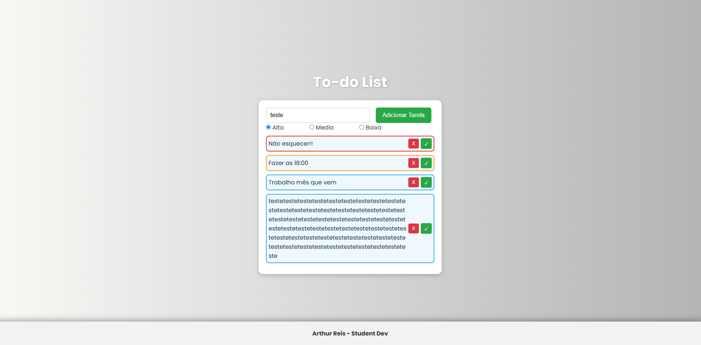

# 📝 To Do List com Prioridades

Este é um projeto simples de **To Do List (lista de tarefas)** feito com HTML, CSS e JavaScript puro.  
Permite adicionar e remover tarefas, além de definir a **prioridade** (baixa, média ou importante), aplicando uma cor visual diferente para cada uma.

## 🚀 Funcionalidades

- Adicionar tarefas com um clique
- Definir prioridade para cada tarefa
- Cores diferentes para cada nível de prioridade
- Remover a última tarefa adicionada

## 🎨 Prioridades e Cores

| Prioridade  | Cor da Borda  
|-------------|---------------
| Importante  | Vermelho        
| Média       | Amarelo        
| Baixa       | Aqua  

## 📷 Preview



## 💻 Como usar

1. Clone o repositório:
   ```bash
   git clone https://github.com/seu-usuario/to-do-list.git
